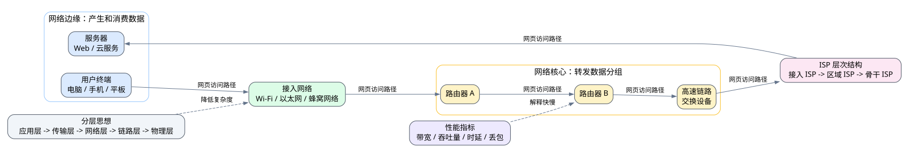

# 第一章 概述

## 1.1 本章导入

计算机网络的核心目标，是让分布在不同位置的计算设备能够交换数据、共享资源并协同工作。

我们日常使用浏览器访问网页、手机刷视频、在线提交作业、远程登录服务器，本质上都是通过 Internet 完成信息传输的过程。

Internet 并不是某一台设备，也不是某一个软件，而是由大量主机、服务器、路由器、交换设备、通信链路、接入网络和 ISP 共同组成的全球性网络系统。

---

## 1.2 Internet 的基本组成

理解 Internet，首先要区分两个重要概念：

- **网络边缘**
- **网络核心**

### 1.2.1 网络边缘

网络边缘指用户直接接触的部分，包括：

- 个人电脑
- 手机、平板等移动设备
- Web 服务器、云服务器
- 家庭宽带
- 校园网
- 蜂窝移动网络

用户发起请求和接收服务，通常都发生在网络边缘。

可以把网络边缘理解为：

> 产生和消费数据的地方。

### 1.2.2 网络核心

网络核心由大量路由器、高速链路和交换设备组成，主要任务是转发数据分组。

可以把网络核心理解为：

> 运输数据的高速通道。

当用户访问网页、下载文件或观看视频时，数据通常会经过多个网络核心设备，最终到达目标服务器或返回用户终端。

---

## 1.3 ISP 与 Internet 的层次结构

Internet 依赖 ISP，即 **Internet Service Provider，互联网服务提供商**。

常见的 ISP 包括：

- 家庭宽带运营商
- 校园网出口网络
- 云服务商网络
- 区域网络运营商
- 骨干网运营商

Internet 并不是所有设备随意连接在一起，而是通过层次化的 ISP 互联形成的。

通常情况下：

> 小型 ISP 接入区域 ISP，区域 ISP 再连接更高层级或骨干 ISP，不同 ISP 之间通过互联形成全球 Internet。

因此，当你访问一个国外网站时，请求通常不会直接到达服务器，而是会经过接入网络、多个路由器、多个 ISP，最终抵达目标服务器。

---

## 1.4 网络性能指标

评价网络性能时，不能只看“网速”这个模糊概念，而要理解几个关键指标。

### 1.4.1 速率与带宽

**带宽**通常表示链路的最大传输能力。

例如：

> 100 Mbps 表示理想情况下每秒最多可以传输 100 兆比特数据。

但是，带宽并不等于用户实际体验到的速度。

### 1.4.2 吞吐量

**吞吐量**是单位时间内真正成功传输的数据量。

实际吞吐量会受到多种因素影响，例如：

- 链路瓶颈
- 网络拥塞
- 协议开销
- 服务器性能
- 无线信号质量

因此，高带宽不一定意味着网页一定打开得快。

可以简单理解为：

> 带宽是理论上限，吞吐量是实际表现。

### 1.4.3 时延

一次数据传输的总时延通常包括四部分：

| 时延类型 | 含义 |
|---|---|
| 处理时延 | 设备检查分组、查找转发表所需的时间 |
| 排队时延 | 分组在路由器或交换设备缓存中等待转发的时间 |
| 传输时延 | 把一个分组的所有比特推入链路所需的时间 |
| 传播时延 | 信号在物理链路中传播所需的时间 |

其中，排队时延在网络拥塞时会明显增加。

### 1.4.4 丢包

**丢包**通常发生在设备缓存已满或链路质量较差时。

丢包可能导致：

- 数据重传
- 视频卡顿
- 游戏延迟升高
- 网页加载变慢
- 实时通信质量下降

因此，网络体验不仅取决于带宽，也取决于时延、丢包率和吞吐量等综合因素。

---

## 1.5 网络体系结构与分层思想

为了降低网络系统的复杂度，计算机网络采用分层体系结构。

每一层只关注自己的职责，并通过明确接口向上层提供服务。

常见的分层理解如下：

| 层次 | 主要职责 |
|---|---|
| 应用层 | 负责具体网络应用，例如浏览器、邮件、文件传输 |
| 传输层 | 负责端到端通信 |
| 网络层 | 负责路径选择和分组转发 |
| 链路层 | 负责相邻节点之间的数据传输 |
| 物理层 | 负责比特在物理介质上传播 |

分层思想的价值在于：

> 某一层的实现可以变化，但只要接口和协议保持一致，就不会影响整个系统。

例如，无论用户使用 Wi-Fi、网线还是 5G，只要下层能够提供通信能力，上层浏览器访问网页的方式就可以保持相对稳定。

---

## 1.6 示例：访问网页的过程

以访问网页为例，学生在浏览器输入网址后，大致会经历以下过程：

1. 用户终端位于网络边缘。
2. 请求通过 Wi-Fi、以太网或移动网络进入接入网络。
3. 数据分组进入网络核心。
4. 分组经过多个路由器和 ISP。
5. 请求最终到达目标服务器。
6. 服务器返回网页数据。
7. 数据沿网络路径回到用户终端。
8. 浏览器解析并显示网页内容。

这个过程可以从两个角度理解：

一方面，可以用 **网络边缘、接入网络、网络核心和 ISP 结构** 来解释数据经过了哪里。

另一方面，也可以用 **带宽、吞吐量、时延和丢包** 来分析网页为什么快或慢。

---

## 1.7 本章重点

本章学习的重点不是死记名词，而是能用基本概念解释真实网络现象。

需要重点掌握：

- 网络边缘和网络核心的区别
- ISP 如何组成全球 Internet
- 带宽和吞吐量的区别
- 时延的四个组成部分
- 丢包对网络体验的影响
- 网络分层体系结构的作用

---

## 1.8 常见误区

### 误区一：把带宽等同于实际网速

带宽只是理论传输能力，实际吞吐量还会受到拥塞、协议开销和服务器性能等因素影响。

### 误区二：只背 OSI 七层名称

学习分层结构时，不能只记层名，更要理解每一层负责什么，以及为什么要分层。

### 误区三：混淆网络边缘和网络核心

网络边缘主要是用户设备和服务器，网络核心主要是路由器、交换设备和高速链路。

### 误区四：忽视丢包和排队时延

很多网络卡顿问题并不是带宽不足，而是由丢包、拥塞和排队时延造成的。

---

## 1.9 实操任务

### 任务一：绘制访问网页过程图

选择一次访问网页的过程，画出以下部分的位置关系：

- 用户终端
- 接入网络
- 网络核心
- ISP
- 目标服务器

### 任务二：分析一次网络测速结果

记录一次网络测速结果，并解释其中的：

- 下载速率
- 上传速率
- 延迟
- 丢包率

思考这些指标分别会影响哪些应用体验，例如网页浏览、视频播放、在线游戏或远程会议。

---

## 1.10 小结

Internet 是由网络边缘、网络核心、接入网络和 ISP 共同构成的复杂系统。

网络边缘负责产生和接收数据，网络核心负责转发数据，ISP 通过层次化互联组成全球 Internet。

在分析网络性能时，需要综合考虑带宽、吞吐量、时延和丢包，而不能只看“网速”。

网络分层体系结构通过明确职责和接口，降低了网络设计与实现的复杂度，是理解计算机网络的重要基础。
