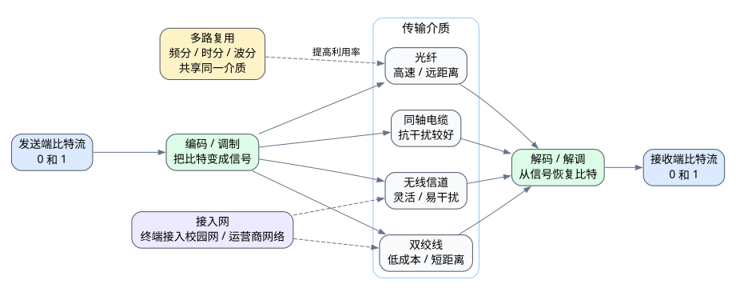

# 第二章 物理层

## 2.1 本章导入

物理层是计算机网络体系结构中最底层的一层。它直接面对真实的传输介质，负责把一串串 **0 和 1 的比特流** 转换成可以在介质上传播的信号，并把接收到的信号还原为比特流。

需要注意的是，物理层并不关心这些比特代表网页、图片、视频还是文件。它只负责解决一个基础问题：

> 如何把比特可靠、有效地从一个节点传到另一个节点。

---

## 2.2 物理层的职责

物理层的主要任务是完成比特级传输。它规定了通信双方在物理连接上的基本规则，例如接口形状、电气特性、光信号特性、无线频段、传输速率、编码方式和同步方式等。

可以把物理层理解为网络通信的“道路和信号系统”。上层协议负责组织数据内容，而物理层负责让这些数据真正通过网线、光纤或无线信道传输出去。

---

## 2.3 传输介质

传输介质是信号传播的载体。常见介质包括双绞线、同轴电缆、光纤和无线信道。

| 传输介质 | 主要特点 | 常见场景 |
|---|---|---|
| 双绞线 | 成本低，部署方便，距离有限 | 宿舍网口、办公室局域网 |
| 同轴电缆 | 抗干扰能力较好，曾广泛用于有线电视网络 | 有线电视宽带 |
| 光纤 | 速率高，距离远，抗电磁干扰强 | 校园骨干网、光纤入户 |
| 无线信道 | 不需要实体线路，灵活方便，但易受干扰 | Wi-Fi、蜂窝移动网络 |

不同介质会影响网络的覆盖范围、建设成本、传输速率和抗干扰能力。例如，宿舍中常见的网线适合短距离接入，而校园楼宇之间更适合使用光纤连接。

---

## 2.4 数据通信基础

数据通信并不是简单地“把数据扔进网线”。计算机中的数据是离散的比特，而真实世界中传输的是电信号、光信号或无线电波。因此，发送端需要把比特编码或调制成信号，接收端再从信号中恢复出比特。

学习本部分时，需要区分两个概念：

> 传输速率表示单位时间内可以传多少比特，传播速度表示信号在介质中传播得多快。

例如，提升链路带宽可以让单位时间内传输更多比特，但不等于信号在光纤或电缆中传播得更快。

信道容量则表示在一定信道条件下，理论上能够达到的最大数据传输能力。实际网络中的速率会受到噪声、干扰、编码方式和设备能力的限制。

---

## 2.5 多路复用

多路复用的作用，是让多个通信信号共享同一条传输介质。

如果每一对用户通信都单独铺设一条线路，成本会非常高，也难以扩展。多路复用通过把时间、频率、波长或编码资源进行划分，使多路信号可以同时或轮流使用同一介质。

常见思想包括：

- **频分复用**：不同信号使用不同频率范围。
- **时分复用**：不同信号在不同时间片中传输。
- **波分复用**：在光纤中使用不同波长传输多路光信号。

多路复用是通信系统提高资源利用率的重要手段。

---

## 2.6 接入网技术

接入网负责把终端用户连接到运营商网络、校园网络或企业网络。家庭宽带、宿舍网口、校园 Wi-Fi、光纤入户和 5G 移动网络都属于接入网相关场景。

以宿舍访问 Internet 为例，终端设备可能先通过 Wi-Fi 连接到路由器，再经过光猫、楼宇交换设备、校园网出口或运营商网络，最终进入更大的 Internet。这个过程中，物理层决定了底层连接使用什么介质、接口和信号传输方式。

---

## 2.7 常见误区

物理层不等于“网线层”。网线只是传输介质之一，光纤、无线信道、接口标准和信号编码也属于物理层关注范围。

另一个常见错误是混淆传输速率和传播速度。传输速率强调单位时间传输的数据量，传播速度强调信号在介质中移动的速度，两者不是同一个概念。

还有一些同学不理解多路复用的必要性。实际上，多路复用的核心价值是节省线路资源，提高介质利用率，是现代通信网络能够大规模运行的重要基础。

---

## 2.8 实操任务

### 任务一：比较校园网络中的传输介质

观察校园或宿舍网络，比较双绞线、光纤和无线信道分别适合哪些位置。重点思考它们在成本、距离、速率和抗干扰能力上的差异。

### 任务二：绘制接入 Internet 的物理路径

以宿舍网络为例，画出从个人电脑或手机到 Internet 的物理连接路径。图中应尽量标出终端设备、网线或 Wi-Fi、路由器、光猫、交换设备和运营商网络的位置关系。

---

## 2.9 本章小结

物理层是网络通信的基础，负责在传输介质上传输比特流。它不解释数据含义，而是关注信号如何表示、如何传播、如何同步以及如何通过接口连接设备。

本章需要重点掌握三条主线：第一，理解双绞线、同轴电缆、光纤和无线信道等传输介质的特点；第二，理解信号、编码、调制、传输速率和信道容量等数据通信基础；第三，理解多路复用和接入网技术在实际网络中的作用。

学完本章后，应能够解释宿舍宽带、校园 Wi-Fi 和光纤入户为什么属于物理层相关场景，并能从传输介质和连接路径角度分析它们的差异。
