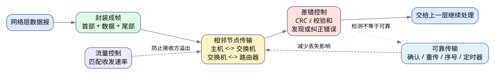

# 第三章 链路层

## 3.1 本章导入

链路层位于物理层之上、网络层之下。物理层只负责传输比特流，而链路层要进一步解决一个问题：

> 如何让数据在相邻节点之间以“帧”的形式正确传输。

这里的“相邻节点”可以是主机和交换机，也可以是交换机和路由器，或者同一局域网中的两台主机。链路层不负责把数据从源主机一路送到最终目的主机，它只关注当前这一段链路上的传输。

---

## 3.2 链路层的基本职责

网络层交给链路层的数据通常是一个数据报。链路层会在其外部加上首部和尾部，形成一个完整的 **帧**，然后交给物理层发送。

可以简单理解为：

> 网络层负责“往哪里走”，链路层负责“这一段怎么送”。

链路层的主要功能包括：

| 功能 | 作用 |
|---|---|
| 封装成帧 | 将网络层数据封装为链路层帧 |
| 透明传输 | 保证数据内容不会被误认为控制信息 |
| 差错控制 | 检测或纠正传输过程中的比特错误 |
| 流量控制 | 防止发送方发送过快导致接收方缓存溢出 |
| 可靠传输 | 通过确认、重传等机制提高传输可靠性 |

不同链路层协议不一定实现所有功能。例如，以太网通常提供差错检测，但不负责端到端可靠传输。

---

## 3.3 帧的概念

帧是链路层传输数据的基本单位。一个帧通常包含帧首部、数据部分和帧尾部。

帧首部中可能包含源地址、目的地址、类型字段等信息；数据部分承载来自网络层的数据；帧尾部常用于差错检测，例如 CRC 校验。

因此，链路层传输的不是孤立的比特，而是具有明确边界和控制信息的帧。

---

## 3.4 差错控制

数据在传输过程中可能受到噪声、干扰或信号衰减影响，导致某些比特发生错误。差错控制的目标就是发现或纠正这些错误。

需要区分两个概念：

> 差错检测只能判断数据可能出错，差错纠正则尝试直接恢复正确数据。

常见的差错检测方法包括奇偶校验、校验和和循环冗余检验 CRC。实际网络中，CRC 是非常常见的差错检测方式。

但要注意：

> 有差错检测不等于一定可靠。

如果接收方发现帧出错后只是丢弃该帧，而没有确认和重传机制，那么数据仍然可能丢失。

---

## 3.5 流量控制

流量控制用于协调发送方和接收方的速率。如果发送方发送得太快，而接收方处理能力有限，就可能导致接收缓存溢出，进而造成帧丢失。

流量控制关注的是：

> 接收方来不来得及收。

这和拥塞控制不同。拥塞控制关注的是网络内部是否过载，例如路由器队列是否堆积、链路是否拥塞。简单来说：

| 机制 | 关注对象 |
|---|---|
| 流量控制 | 接收方处理能力 |
| 拥塞控制 | 网络内部负载 |

这是本章非常容易混淆的知识点。

---

## 3.6 可靠传输机制

可靠传输的目标是尽可能保证数据正确、完整、有序地到达。常见机制包括确认、重传、序号和定时器。

基本过程可以理解为：

1. 发送方发送一个帧。
2. 接收方正确收到后返回确认。
3. 如果发送方在规定时间内没有收到确认，就认为帧可能丢失或损坏。
4. 发送方重新发送该帧。
5. 序号用于区分新帧和重复帧，避免接收方重复接收同一份数据。

最简单的可靠传输方式是停止等待协议，即发送方每发送一个帧，就等待确认后再发送下一个帧。这种方式逻辑简单，但效率较低。为了提高效率，可以使用滑动窗口机制，让发送方连续发送多个帧，再根据确认情况进行调整。

---

## 3.7 常见链路层协议

链路层协议的设计通常需要在效率、可靠性和复杂度之间进行权衡。

以太网适合局域网环境，设计目标是高效、低成本地连接大量设备。PPP 常用于点到点链路。Wi-Fi 属于无线局域网技术，需要考虑无线信道竞争、干扰和移动性等问题。

不同协议面对的链路环境不同，因此设计重点也不同。

---

## 3.8 示例：局域网内主机通信

当一台主机向同一局域网内另一台主机发送数据时，网络层会先产生数据报，链路层再将其封装成帧。网卡根据帧中的地址信息发送数据，交换机根据链路层地址转发帧。

接收方收到帧后，会通过差错检测判断帧是否损坏。如果帧没有明显错误，就提取其中的数据并交给上一层继续处理。

这个过程体现了链路层的核心作用：

> 在相邻节点之间组织帧传输，并尽可能减少传输错误带来的影响。

---

## 3.9 常见误区

### 误区一：把链路层和网络层混为一谈

链路层只负责相邻节点之间的一段传输，网络层负责跨多个网络的路径选择和分组转发。

### 误区二：认为差错检测等于可靠传输

差错检测只能发现错误，可靠传输还需要确认、重传、序号和定时器等机制配合。

### 误区三：混淆流量控制和拥塞控制

流量控制防止接收方被“撑爆”，拥塞控制防止网络内部被“堵住”。

---

## 3.10 实操任务

### 任务一：机制辨析表

用表格比较以下机制的目标、解决的问题和常见方法：

| 机制 | 目标 | 常见方法 |
|---|---|---|
| 差错检测 | 发现传输错误 | CRC、校验和 |
| 差错纠正 | 尝试恢复错误数据 | 纠错编码 |
| 流量控制 | 匹配收发速率 | 窗口机制 |
| 可靠传输 | 保证数据尽量正确到达 | 确认、重传、序号、定时器 |

### 任务二：绘制确认重传时序图

画出一个简单的确认重传过程，包括：

- 发送方发送帧
- 接收方返回确认
- 帧丢失或确认丢失
- 发送方超时重传

通过这个图理解可靠传输为什么需要定时器和序号。

---

## 3.11 本章小结

链路层是连接物理层和网络层的重要层次。它把网络层数据封装成帧，并负责在相邻节点之间传输。

本章重点不是死记协议名称，而是理解链路层为什么需要帧、差错控制、流量控制和可靠传输。学习时要特别注意区分链路层和网络层的职责，也要区分差错检测、差错纠正、可靠传输、流量控制和拥塞控制。

掌握这些概念后，就能更清楚地理解局域网通信、网卡发送数据、交换机转发帧以及链路传输错误处理等实际网络现象。
