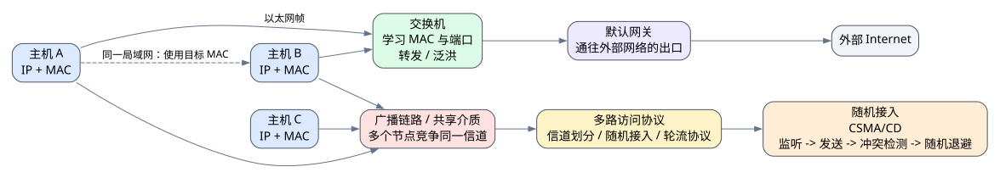

# 第四章 广播链路与局域网

## 4.1 本章导入

前一章学习了链路层的基本功能：把网络层数据封装成帧，并在相邻节点之间传输。本章进一步讨论一种更具体的链路环境：**广播链路**。

在广播链路中，多个节点共享同一通信介质。也就是说，一个节点发送数据时，其他节点都有可能“听到”这个信号。这样虽然可以节省通信资源，但也带来了一个关键问题：

> 如果多个节点同时发送数据，会不会互相干扰？

这就是广播链路中的共享介质访问问题。为了解决这个问题，链路层需要设计多路访问协议，协调多个节点对信道的使用。

---

## 4.2 广播链路的基本问题

广播链路的特点是多个设备共享同一传输介质。例如早期总线型以太网、无线局域网等，都具有明显的广播链路特征。

在这种环境下，如果只有一个节点发送数据，其他节点接收，通信通常可以顺利进行。但如果两个或多个节点同时发送数据，信号可能在共享介质上发生冲突，导致接收方无法正确识别数据。

因此，广播链路的核心问题可以概括为：

> 多个节点共享一条信道时，如何决定谁可以发送数据。

这个问题不是物理层单独能解决的，因为物理层只负责传输比特，而链路层需要负责组织帧的发送、识别和协调。

---

## 4.3 多路访问协议

多路访问协议用于协调多个节点对共享信道的使用，目标是减少冲突，提高信道利用率。

常见的多路访问思想可以分为三类：

| 类型 | 基本思想 | 特点 |
|---|---|---|
| 信道划分协议 | 把信道资源预先划分给不同节点 | 冲突少，但资源可能浪费 |
| 随机接入协议 | 节点需要发送时直接竞争信道 | 灵活，但可能发生冲突 |
| 轮流协议 | 节点按一定顺序获得发送机会 | 较公平，但控制开销较大 |

信道划分协议类似于“提前分座位”，每个用户有固定资源。随机接入协议类似于“谁有话就先说”，如果多人同时说话，就需要处理冲突。轮流协议类似于“依次发言”，能够减少冲突，但需要额外机制维护顺序。

---

## 4.4 随机接入协议

随机接入协议允许节点在有数据要发送时竞争信道。它的优点是机制灵活，不需要提前为每个节点固定分配资源；缺点是多个节点可能同时发送，从而产生冲突。

随机接入协议通常要解决两个问题：

> 如何发现冲突，以及冲突后如何恢复。

以太网中的经典思想是 CSMA/CD，即载波监听多路访问/冲突检测。其基本逻辑是：节点发送前先监听信道，如果信道空闲就发送；如果发送过程中检测到冲突，就停止发送，并等待一段随机时间后重试。

可以简单理解为：

1. 发送前先听一听有没有人在发送。
2. 如果没人发送，就开始发送。
3. 如果发现冲突，就停止发送。
4. 随机等待后重新尝试。

随机等待很重要。如果发生冲突的节点立刻同时重发，就可能再次发生冲突。随机退避机制可以降低重复冲突的概率。

---

## 4.5 局域网的基本特点

局域网通常覆盖较小的地理范围，例如宿舍、实验室、办公室、教学楼或校园内部网络。

局域网的主要特点包括：

- 覆盖范围较小
- 传输速率较高
- 时延较低
- 管理相对集中
- 常用于连接主机、服务器、打印机和交换机等设备

在局域网中，设备之间的通信不仅依赖 IP 地址，也依赖链路层地址，即 MAC 地址。IP 地址主要用于网络层寻址，帮助数据跨网络到达目标主机；MAC 地址用于链路层通信，帮助数据在当前局域网或当前链路上找到具体设备。

---

## 4.6 以太网的基本工作机制

以太网是最常见的局域网技术之一。它围绕 **以太网帧、MAC 地址和交换机转发** 展开。

一台主机发送数据时，链路层会把网络层交下来的数据封装成以太网帧。以太网帧中通常包含目的 MAC 地址、源 MAC 地址、类型字段、数据部分和差错检测字段。

可以简单理解为：

> IP 地址决定“最终要去哪里”，MAC 地址决定“当前这一段交给谁”。

在现代局域网中，多台设备通常通过交换机连接。交换机会根据帧中的目的 MAC 地址决定从哪个端口转发。如果交换机不知道目标 MAC 地址在哪个端口，可能会先进行泛洪；当它学习到设备的 MAC 地址和端口对应关系后，就可以更精确地转发帧。

---

## 4.7 MAC 地址与 IP 地址的区别

MAC 地址和 IP 地址是本章的重点易混概念。

| 对比项 | MAC 地址 | IP 地址 |
|---|---|---|
| 所属层次 | 链路层 | 网络层 |
| 主要作用 | 当前链路或局域网内寻址 | 跨网络寻址 |
| 常见形式 | 十六进制表示，如 `A0-B1-C2-D3-E4-F5` | 点分十进制，如 `192.168.1.10` |
| 是否容易变化 | 通常与网卡相关，相对固定 | 可由 DHCP 分配，较容易变化 |
| 典型使用场景 | 以太网帧转发 | IP 数据报转发 |

同一局域网内两台主机通信时，发送方不仅需要知道目标主机的 IP 地址，还需要知道目标主机的 MAC 地址。因为真正交给网卡发送的是链路层帧，而帧转发需要 MAC 地址。

---

## 4.8 示例：宿舍局域网通信

假设宿舍中有一台电脑和一台手机连接到同一个路由器或交换机。当电脑要向手机发送数据时，网络层会确定目标 IP 地址，链路层则需要使用目标设备的 MAC 地址封装以太网帧。

如果目标设备在同一局域网内，数据可以直接通过交换机或无线接入点在局域网中转发。如果目标设备不在同一局域网内，例如访问外部网站，数据帧通常会先发给默认网关，再由网关继续转发到外部网络。

因此，默认网关在局域网中非常重要。它相当于本局域网通往外部网络的出口。

---

## 4.9 常见误区

### 误区一：认为局域网通信只依赖 IP 地址

IP 地址用于网络层寻址，但在局域网内部真正发送帧时，还需要 MAC 地址。没有 MAC 地址，链路层无法完成以太网帧的局部交付。

### 误区二：混淆 MAC 地址和 IP 地址

MAC 地址服务于链路层，主要用于当前链路或局域网内通信；IP 地址服务于网络层，主要用于跨网络通信。二者不是替代关系，而是配合关系。

### 误区三：不理解共享介质为什么会冲突

在共享介质中，多个节点共用同一信道。如果两个节点同时发送信号，接收方可能无法正确区分这些信号，从而导致冲突。多路访问协议正是为了解决这个问题而设计的。

### 误区四：认为交换机只是“插网线的盒子”

交换机不是简单的物理连接设备。它会学习 MAC 地址与端口的对应关系，并根据目的 MAC 地址转发以太网帧。

---

## 4.10 实操任务

### 任务一：查看本机网络参数

在自己的电脑上查看以下信息：

- 本机 IP 地址
- 本机 MAC 地址
- 默认网关
- 子网掩码

思考这些信息分别属于哪一层，分别有什么作用。

### 任务二：解释局域网内通信过程

以同一局域网内两台主机通信为例，说明以下问题：

1. IP 地址在通信中起什么作用？
2. MAC 地址在通信中起什么作用？
3. 为什么数据帧需要目的 MAC 地址？
4. 如果目标主机不在同一局域网内，为什么要先发给默认网关？

### 任务三：绘制局域网通信流程图

画出宿舍或实验室局域网结构图，至少包含：

- 终端设备
- 路由器或交换机
- 默认网关
- 局域网内部通信路径
- 访问外部 Internet 的路径

---

## 4.11 本章小结

广播链路的核心问题是多个节点共享同一通信介质时，如何协调发送行为。多路访问协议用于解决共享信道中的竞争和冲突问题，其中随机接入协议强调节点按需竞争信道，并通过冲突检测、随机退避等机制恢复通信。

局域网通常覆盖较小范围，具有低时延和较高吞吐量的特点。以太网是最常见的局域网技术之一，其核心机制包括以太网帧、MAC 地址和交换机转发。

学习本章时，要重点掌握三组关系：广播链路与多路访问协议的关系，随机接入与冲突恢复的关系，MAC 地址与 IP 地址的关系。理解这些内容后，就能解释宿舍、实验室或校园局域网中设备之间是如何完成通信的。
