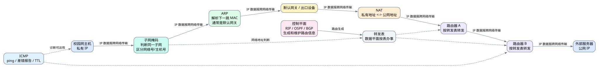

# 第五章 网络层

## 5.1 本章导入

前面几章主要讨论了物理层和链路层。物理层负责传输比特，链路层负责在相邻节点之间传输帧。但是，仅靠链路层还不能完成大范围的网络通信。

例如，宿舍电脑访问一个外部网站时，数据并不是只在同一个局域网内传输，而是要经过校园网、运营商网络、骨干网络，最终到达目标服务器所在的网络。这个过程涉及多个不同网络之间的转发，这正是网络层要解决的问题。

网络层的核心任务可以概括为：

> 实现从源主机到目的主机的跨网络分组传输。

其中，网络层传输的基本单位通常称为 **分组** 或 **IP 数据报**。



---

## 5.2 网络层的基本服务

网络层向上层提供主机到主机之间的通信能力。它不关心应用层传输的是网页、图片还是视频，而是关注数据分组如何从源地址到达目的地址。

网络层的服务通常可以理解为两类：

| 服务类型 | 含义 |
|---|---|
| 无连接服务 | 每个分组独立转发，不预先建立固定连接 |
| 面向连接服务 | 发送数据前先建立逻辑连接，再沿连接传输 |

在 Internet 中，IP 协议主要提供无连接、不可靠的分组交付服务。这里的“不可靠”不是说 IP 没有用，而是指 IP 本身不保证分组一定到达、不保证按序到达，也不保证不重复。可靠性通常由更高层协议，例如 TCP 来补充。

因此，IP 的重点不是“保证每个数据都可靠到达”，而是提供一种尽力而为的跨网络传输能力。

---

## 5.3 数据平面与控制平面

学习网络层时，一个非常重要的思路是区分 **数据平面** 和 **控制平面**。

数据平面关注的是：

> 当一个分组到达路由器时，路由器应该把它从哪个接口转发出去。

控制平面关注的是：

> 路由器如何知道这些转发规则，以及网络路径信息如何生成和维护。

二者的区别可以用下表理解：

| 平面 | 关注问题 | 典型内容 |
|---|---|---|
| 数据平面 | 单个分组如何被转发 | IP、ARP、ICMP、NAT、转发表 |
| 控制平面 | 路由信息如何生成和维护 | RIP、OSPF、BGP、路由算法 |

简单来说：

> 转发是“按表办事”，路由是“生成这张表”。

这是本章最重要的概念之一。很多同学会把转发和路由混为一谈，但它们的侧重点不同。转发发生在每个分组到达路由器时，动作很具体；路由则是计算、交换和维护路径信息的过程。

---

## 5.4 IP 协议

IP 是网络层最核心的协议之一。它通过 IP 地址标识主机和网络，使数据能够跨越多个网络传输。

IP 地址不仅表示一台主机，也隐含了该主机所在的网络。路由器可以根据目的 IP 地址判断分组应该被转发到哪个方向。

可以把 IP 地址理解为跨网络通信中的“逻辑地址”。它和链路层中的 MAC 地址不同：

| 地址类型 | 所属层次 | 主要作用 |
|---|---|---|
| MAC 地址 | 链路层 | 当前局域网或当前链路内交付帧 |
| IP 地址 | 网络层 | 跨网络定位主机和网络 |

当数据跨越多个网络传输时，目的 IP 地址通常保持不变，而每一段链路上的源 MAC 地址和目的 MAC 地址可能会不断变化。

### 5.4.1 子网划分与子网掩码

在实际网络中，一个组织通常不会把所有主机都放在同一个 IP 网络中，而是会根据部门、楼宇、实验室或管理边界划分为多个子网。

**子网划分**的作用，是把一个较大的地址块进一步拆分成多个较小的网络，使地址分配、广播范围控制和网络管理更加灵活。

子网掩码用于区分 IP 地址中的网络部分和主机部分。例如：

```text
IP 地址：192.168.1.65
子网掩码：255.255.255.192
前缀长度：/26
```

`/26` 表示前 26 位是网络部分，剩余 6 位是主机部分。一个 `/26` 地址块共有 `2^6 = 64` 个地址，通常可分配给主机的地址数量还要扣除网络地址和广播地址，因此可用主机地址数为 `64 - 2 = 62`。

判断两台主机是否在同一子网中，常用方法是：

> 分别将两台主机的 IP 地址与子网掩码做按位与运算，如果得到的网络地址相同，就在同一子网中。

例如，在 `255.255.255.0` 掩码下，`192.168.1.10` 和 `192.168.1.20` 的网络地址都是 `192.168.1.0`，通常可认为它们在同一子网中；而 `192.168.2.10` 属于另一个网络。

子网划分时需要同时考虑两个问题：

- 需要多少个子网
- 每个子网需要容纳多少台主机

如果借用更多主机位作为子网位，就能划分出更多子网，但每个子网能容纳的主机数量会减少。因此，子网划分本质上是在“子网数量”和“每个子网主机容量”之间进行权衡。

---

## 5.5 ARP 协议

ARP 的作用是把 IP 地址解析为 MAC 地址。它主要工作在同一局域网内部。

例如，主机知道目标主机的 IP 地址，但要在局域网内真正发送以太网帧，还必须知道目标设备的 MAC 地址。这时就需要 ARP。

ARP 的基本过程可以理解为：

1. 主机想发送数据给某个局域网内的 IP 地址。
2. 主机先检查自己的 ARP 缓存表。
3. 如果缓存中没有对应 MAC 地址，就广播 ARP 请求。
4. 目标主机收到请求后，返回自己的 MAC 地址。
5. 发送方获得 MAC 地址后，再封装以太网帧并发送。

需要特别注意：

> ARP 不能跨越多个网络工作，它只解决当前局域网内 IP 地址到 MAC 地址的映射问题。

如果目标主机不在同一个局域网内，发送方通常不会解析目标主机的 MAC 地址，而是解析默认网关的 MAC 地址，然后把数据先交给网关。

---

## 5.6 ICMP 协议

ICMP 是 Internet Control Message Protocol，即 Internet 控制报文协议。它常用于差错报告和网络诊断。

最典型的应用是 `ping` 命令。使用 `ping` 某个地址时，主机会发送 ICMP 请求报文，目标主机如果可达，会返回 ICMP 应答报文。通过这个过程，可以大致判断目标主机是否可达，以及往返时延大约是多少。

ICMP 和 IP 的关系可以理解为：

> ICMP 依赖 IP 传输，但它用于报告 IP 分组传输过程中的控制信息和异常情况。

例如，当分组无法到达目标网络，或者 TTL 减为 0 时，网络设备可能会发送 ICMP 差错报文。路由跟踪工具也经常利用 ICMP 或相关机制观察数据经过的路径。

---

## 5.7 NAT 技术

NAT 是 Network Address Translation，即网络地址转换。它常用于私有地址和公网地址之间的转换。

在家庭网络、宿舍网络或校园网中，很多终端使用的是私有 IP 地址，例如 `192.168.x.x`、`10.x.x.x` 或 `172.16.x.x` 到 `172.31.x.x` 范围内的地址。这些地址不能直接在公网中路由。

当私有地址主机访问公网服务时，NAT 设备会把内部私有地址转换为公网地址，并记录转换关系。公网服务器返回数据时，NAT 设备再根据记录把数据转回内部主机。

可以简单理解为：

> NAT 让多个内网设备可以共享一个或少量公网地址访问 Internet。

NAT 的好处是节省公网 IPv4 地址，并在一定程度上隐藏内部网络结构。但它也会带来端到端通信受限、某些应用穿透困难等问题。

---

## 5.8 控制平面与路由协议

控制平面的核心任务是生成和维护路由信息。路由器需要知道到达不同网络的路径，而这些路径信息通常由路由协议交换和计算得到。

常见路由协议包括 RIP、OSPF 和 BGP。

| 协议 | 适用范围 | 基本特点 |
|---|---|---|
| RIP | 小型网络或简单内部网络 | 基于距离向量，简单但扩展性较弱 |
| OSPF | 较大规模内部网络 | 基于链路状态，收敛较快，适合自治系统内部 |
| BGP | 不同自治系统之间 | 用于 Internet 级别的域间路由，重视策略控制 |

RIP 和 OSPF 通常属于自治系统内部的路由协议，也就是 IGP。BGP 则用于自治系统之间的路由选择，也就是 EGP。

可以简单理解为：

> RIP 和 OSPF 主要解决一个组织内部怎么走，BGP 主要解决不同组织或运营商网络之间怎么走。

BGP 不只考虑路径长短，还会考虑运营商策略、商业关系、网络管理规则等因素。因此，Internet 级别的路由选择并不是单纯选择“最短路径”。

---

## 5.9 示例：校园网访问外部网站

假设学生在校园网中访问一个外部网站。整个过程可以分成几个阶段理解。

首先，学生电脑根据目标网站的 IP 地址判断目标是否在同一局域网内。如果不在同一局域网内，就需要把数据交给默认网关。

这个判断通常依赖本机 IP 地址、目标 IP 地址和子网掩码。主机会先计算目标是否与自己处在同一子网：如果在同一子网，就尝试解析目标主机的 MAC 地址；如果不在同一子网，就解析默认网关的 MAC 地址。

接着，主机需要知道默认网关的 MAC 地址。如果本地 ARP 缓存中没有记录，就通过 ARP 请求获得网关的 MAC 地址，然后把 IP 数据报封装进以太网帧，发送给网关。

然后，网关或校园网出口设备根据目的 IP 地址继续转发分组。如果内部主机使用的是私有地址，出口设备还可能执行 NAT，把私有地址转换为公网地址。

之后，分组会经过多个路由器和网络。每个路由器根据自己的转发表执行转发，而这些转发表通常由路由协议或网络管理员配置生成。

最后，目标服务器收到请求并返回响应数据。返回的数据再经过路由器、NAT 设备和局域网，回到学生电脑。

这个例子体现了网络层多个核心机制的配合：

- IP 用于跨网络寻址。
- 子网掩码用于判断目标是否在同一子网。
- ARP 用于当前局域网内解析下一跳 MAC 地址。
- NAT 用于私有地址和公网地址转换。
- ICMP 可用于诊断通信是否可达。
- 路由协议负责生成和维护路径信息。

---

## 5.10 常见误区

### 误区一：把转发和路由混为一谈

转发是数据平面的动作，关注单个分组到达后从哪个接口出去。路由是控制平面的过程，关注路径信息如何计算、交换和维护。

### 误区二：认为 ARP 可以跨网络工作

ARP 只在当前局域网内解析 IP 地址到 MAC 地址的映射。跨网络通信时，主机通常解析的是默认网关的 MAC 地址，而不是远端服务器的 MAC 地址。

### 误区三：只会背子网掩码，不会判断同一子网

子网掩码不是一个孤立参数。它的核心作用是区分网络号和主机号，并帮助主机判断目标地址是否属于同一子网。判断时要把 IP 地址和子网掩码做按位与运算。

### 误区四：不理解 ICMP 与 IP 的关系

ICMP 不是用来替代 IP 的。它依赖 IP 传输，主要用于差错报告和网络诊断。

### 误区五：只背 RIP、OSPF、BGP 名称

学习路由协议时，不能只记名称。应重点理解它们适用的网络规模和管理边界：RIP 适合简单小型网络，OSPF 适合较复杂的内部网络，BGP 用于自治系统之间的域间路由。

---

## 5.11 实操任务

### 任务一：使用 ping 观察 ICMP

在命令行中使用：

```bash
ping www.example.com
```

观察返回结果中的时间、丢包率等信息，并思考这些指标说明了什么。

注意：如果目标主机禁止 ICMP 应答，`ping` 失败不一定代表目标网站完全不可访问。

### 任务二：绘制 NAT 地址转换过程

以家庭或宿舍网络为例，画出一台私有地址主机访问公网服务器时的地址变化过程。

图中至少包含：

- 内网主机私有 IP 地址
- NAT 设备
- NAT 转换后的公网地址
- 公网服务器地址
- 返回数据如何映射回内网主机

### 任务三：练习子网判断与子网划分

完成以下练习：

1. 判断 `192.168.1.10/24` 和 `192.168.1.80/24` 是否在同一子网。
2. 判断 `192.168.1.10/24` 和 `192.168.2.10/24` 是否在同一子网。
3. 如果一个 `/24` 地址块需要划分成 4 个等长子网，写出新的前缀长度，并说明每个子网大约能容纳多少台主机。

重点说明：子网掩码如何区分网络部分和主机部分。

### 任务四：比较 RIP、OSPF 和 BGP

完成下表：

| 协议 | 属于内部还是外部路由协议 | 适合场景 | 主要特点 |
|---|---|---|---|
| RIP | 内部路由协议 | 小型网络 | 简单，扩展性有限 |
| OSPF | 内部路由协议 | 中大型内部网络 | 收敛较快，适合复杂拓扑 |
| BGP | 外部路由协议 | 自治系统之间 | 支持策略控制，适合 Internet 级路由 |

---

## 5.12 本章小结

网络层负责实现跨网络的分组传输，是连接不同局域网、运营商网络和全球 Internet 的关键层次。

学习本章时，要抓住两条主线。第一条是数据平面，重点理解 IP、ARP、ICMP、NAT 等机制如何参与分组转发。第二条是控制平面，重点理解路由协议如何生成和维护路径信息。

本章最重要的辨析是：转发不等于路由，子网掩码用于区分网络号和主机号，ARP 不跨网络，ICMP 主要用于控制和诊断，NAT 负责私有地址与公网地址转换，RIP、OSPF 和 BGP 适用于不同规模和管理边界的网络。掌握这些内容后，就能更清楚地解释校园网、宿舍网和公网服务之间的数据传输过程。
