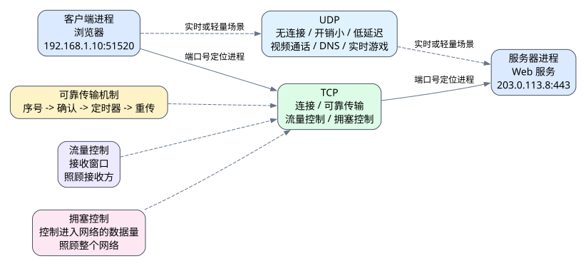

# 第六章 传输层

## 6.1 本章导入

前一章学习了网络层。网络层的核心任务是实现 **主机到主机** 的通信，也就是让一个 IP 数据报能够从源主机到达目的主机。

但是，真实网络通信并不是“主机和主机”在直接交流，而是主机上的具体应用进程在交流。例如，浏览器访问 Web 服务器，本质上是用户电脑上的浏览器进程和服务器上的 Web 服务进程进行通信。仅有 IP 地址只能定位到一台主机，不能区分这台主机上到底是哪一个应用进程。

因此，传输层要进一步解决的问题是：

> 如何在网络层主机到主机通信的基础上，实现进程到进程的通信。

传输层位于网络层之上、应用层之下，是连接网络传输能力和具体应用服务的重要层次。



---

## 6.2 传输层的基本职责

传输层的核心职责是为不同主机上的应用进程提供通信服务。网络层把数据送到目标主机，传输层则负责把数据交给目标主机上的正确进程。

可以简单理解为：

> IP 地址负责找到哪台主机，端口号负责找到这台主机上的哪个进程。

传输层主要关注以下问题：

| 问题 | 含义 |
|---|---|
| 进程标识 | 如何区分同一主机上的不同应用进程 |
| 可靠传输 | 如何应对丢包、乱序、重复等问题 |
| 流量控制 | 如何避免发送方压垮接收方 |
| 拥塞控制 | 如何避免过多数据造成网络内部拥塞 |
| 传输策略选择 | 什么时候使用 TCP，什么时候使用 UDP |

传输层并不负责决定分组经过哪条路径，这属于网络层和路由机制的工作。传输层更多关注端到端应用进程之间的数据交付质量。

---

## 6.3 端口与套接字

一台主机上可能同时运行多个网络应用，例如浏览器、微信、远程登录工具、下载器和邮件客户端。它们可能同时通过网络收发数据。如果只有 IP 地址，操作系统无法判断收到的数据应该交给哪个进程。

为了解决这个问题，传输层引入了 **端口号**。

端口号用于标识主机上的具体应用进程。例如，Web 服务常见端口是 80 或 443，SSH 常见端口是 22。客户端程序在访问服务器时，也会由系统分配一个临时端口，用来标识当前这次通信。

**套接字**通常可以理解为由 IP 地址和端口共同参与描述的通信端点。例如：

```text
客户端：192.168.1.10:51520
服务器：203.0.113.8:443
```

其中，`192.168.1.10` 和 `203.0.113.8` 是 IP 地址，`51520` 和 `443` 是端口号。通过 IP 地址和端口号的组合，系统才能准确区分不同应用进程之间的通信。

---

## 6.4 可靠传输

网络层的 IP 协议通常只提供尽力而为的传输服务，不保证分组一定到达，也不保证按顺序到达。因此，如果应用需要可靠的数据交付，传输层就必须设计可靠传输机制。

可靠传输的目标是降低以下问题带来的影响：

- 分组丢失
- 分组损坏
- 分组乱序
- 分组重复

常见机制包括：

| 机制 | 作用 |
|---|---|
| 序号 | 标识数据顺序，区分新数据和重复数据 |
| 确认 | 接收方告诉发送方哪些数据已经收到 |
| 重传 | 数据丢失或确认超时时重新发送 |
| 定时器 | 判断等待确认是否超时 |
| 校验 | 检测数据在传输中是否出错 |

一个简单的确认与重传过程如下：

1. 发送方发送一段数据，并记录其序号。
2. 接收方正确收到数据后，返回确认信息。
3. 如果发送方在规定时间内没有收到确认，就认为数据可能丢失。
4. 发送方重新发送这段数据。
5. 接收方通过序号判断该数据是新的还是重复的。

因此，可靠传输不是靠某一个机制完成的，而是由序号、确认、重传和定时器等机制配合实现的。

---

## 6.5 流量控制

流量控制关注的是接收方的处理能力。

如果发送方发送数据太快，而接收方处理速度较慢，或者接收缓冲区空间不足，就可能导致数据来不及处理而被丢弃。流量控制的作用，就是让发送方根据接收方的能力调整发送速度。

可以简单理解为：

> 流量控制防止发送方把接收方“压垮”。

在 TCP 中，流量控制通常通过接收窗口实现。接收方会告诉发送方自己当前还能接收多少数据，发送方根据这个窗口大小控制未确认数据的数量。

---

## 6.6 拥塞控制

拥塞控制关注的是网络内部的负载情况。

即使接收方处理能力很强，如果网络中大量发送方同时发送数据，也可能导致链路和路由器队列过载，产生排队时延增大、丢包率升高等问题。这种情况就是网络拥塞。

拥塞控制的作用是：

> 防止过多数据同时进入网络，导致网络整体性能下降。

流量控制和拥塞控制非常容易混淆，可以用下表区分：

| 机制 | 关注对象 | 主要问题 |
|---|---|---|
| 流量控制 | 接收方 | 接收方来不来得及收 |
| 拥塞控制 | 网络内部 | 链路和路由器是否过载 |

简单来说，流量控制是照顾接收方，拥塞控制是照顾整个网络。

---

## 6.7 TCP 的基本特点

TCP 是传输层中最重要的协议之一。它是面向连接的、可靠的传输协议。

TCP 的主要特点包括：

- 面向连接
- 提供可靠传输
- 支持流量控制
- 支持拥塞控制
- 面向字节流

所谓面向连接，是指通信双方在正式传输数据前，需要先建立连接。常见的 TCP 三次握手就是连接建立过程。三次握手的目的不是为了“走形式”，而是让通信双方确认彼此的收发能力，并协商后续通信所需的一些初始信息。

TCP 适用于对可靠性要求较高的场景，例如：

- 网页访问
- 文件下载
- 邮件传输
- 远程登录
- 数据库连接

这些应用通常不能接受数据缺失或错误。例如，下载一个程序安装包时，如果中间少了一部分数据，文件就可能无法使用。因此这类场景通常更适合使用 TCP。

---

## 6.8 UDP 的基本特点

UDP 是另一种重要的传输层协议。它比 TCP 更轻量，不建立连接，也不在协议层面提供复杂的可靠传输、流量控制和拥塞控制机制。

UDP 的特点包括：

- 无连接
- 首部开销小
- 传输延迟较低
- 不保证可靠交付
- 应用层可以自行设计控制策略

很多同学会认为 UDP “不可靠，所以没用”。这是错误的。UDP 的优势在于简单、快速、灵活。对于某些实时性要求较高的应用，偶尔丢失一小部分数据可能比长时间等待重传更能接受。

UDP 常见使用场景包括：

- 视频通话
- 在线语音
- 实时游戏
- DNS 查询
- 某些流媒体传输

例如，视频通话中如果某一帧画面丢失，系统通常更倾向于继续播放后续画面，而不是停下来等待这一帧重传。否则用户感受到的可能是明显卡顿。

---

## 6.9 TCP 与 UDP 对比

| 对比项 | TCP | UDP |
|---|---|---|
| 是否连接 | 面向连接 | 无连接 |
| 可靠性 | 提供可靠传输 | 不保证可靠交付 |
| 控制机制 | 有流量控制和拥塞控制 | 协议本身较少控制 |
| 开销 | 较大 | 较小 |
| 实时性 | 相对较弱 | 相对较好 |
| 典型应用 | Web、文件下载、邮件、SSH | 视频通话、DNS、实时游戏 |

选择 TCP 还是 UDP，不是简单看哪个“更高级”，而是看应用需求。

如果应用更重视数据完整性和准确性，通常选择 TCP。如果应用更重视实时性、低延迟或希望自己控制可靠性策略，可能选择 UDP。

---

## 6.10 示例：浏览器访问 Web 服务器

当浏览器访问一个网站时，客户端主机和服务器主机之间首先需要通过 IP 地址完成网络层寻址。但这还不够，因为服务器上可能运行多个服务，例如 Web 服务、数据库服务、SSH 服务等。

浏览器需要访问的是 Web 服务，因此还需要使用对应的端口。例如，HTTPS 通常使用 443 端口。

整个过程可以简化理解为：

1. 浏览器进程发起访问请求。
2. 客户端使用自己的 IP 地址和临时端口。
3. 服务器使用自己的 IP 地址和服务端口。
4. TCP 建立连接。
5. 双方通过 TCP 可靠传输应用层数据。
6. TCP 根据接收方能力进行流量控制。
7. TCP 根据网络拥塞程度调整发送速率。
8. 应用层最终获得网页数据并显示。

这个例子体现了传输层的核心作用：

> 在主机到主机通信的基础上，为具体应用进程提供端到端通信服务。

---

## 6.11 常见误区

### 误区一：把 IP 地址当成应用进程标识

IP 地址只能定位到主机，不能唯一标识主机上的某个应用进程。标识应用进程还需要端口号。

### 误区二：混淆流量控制和拥塞控制

流量控制关注接收方是否来得及处理数据，拥塞控制关注网络内部是否过载。二者都可能影响发送速率，但目标不同。

### 误区三：认为 UDP 一定不可靠且不可使用

UDP 不在协议层面保证可靠传输，但它轻量、延迟低、灵活性高。很多实时应用会选择 UDP，并在应用层自行处理必要的控制逻辑。

### 误区四：只背 TCP 三次握手流程

三次握手不是孤立知识点。学习 TCP 时更重要的是理解它为什么需要连接、为什么需要确认和重传、为什么需要流量控制和拥塞控制。

---

## 6.12 实操任务

### 任务一：画出进程通信关系图

以浏览器访问 Web 服务器为例，画出以下元素之间的关系：

- 客户端主机 IP 地址
- 客户端临时端口
- 浏览器进程
- 服务器 IP 地址
- 服务器端口
- Web 服务进程

重点说明：为什么只有 IP 地址还不够，为什么还需要端口号。

### 任务二：绘制 TCP 确认与重传时序图

画出一个简单的 TCP 可靠传输过程，至少包括：

- 发送方发送数据段
- 接收方返回确认
- 数据段丢失或确认丢失
- 发送方定时器超时
- 发送方重传数据段

通过这个图理解序号、确认、重传和定时器之间的配合关系。

### 任务三：比较视频通话和文件下载

分析以下两个场景为什么可能选择不同传输策略：

| 场景 | 关注重点 | 可能选择 |
|---|---|---|
| 视频通话 | 低延迟、连续播放 | UDP 或基于 UDP 的协议 |
| 文件下载 | 数据完整、准确无误 | TCP |

思考：为什么视频通话可以容忍少量丢包，但文件下载通常不能容忍数据缺失？

---

## 6.13 本章小结

传输层位于网络层之上，核心任务是实现不同主机上应用进程之间的通信。网络层解决主机到主机的问题，传输层进一步通过端口号和套接字解决进程到进程的问题。

本章需要重点掌握四组概念。第一，IP 地址和端口号的区别：IP 地址定位主机，端口号定位进程。第二，可靠传输的基本机制：序号、确认、重传和定时器。第三，流量控制和拥塞控制的区别：前者关注接收方，后者关注网络内部。第四，TCP 和 UDP 的使用场景：TCP 重视可靠性，UDP 重视轻量和实时性。

掌握这些内容后，就能解释浏览器访问网站、文件下载、视频通话、实时游戏等应用为什么会采用不同的传输策略。
