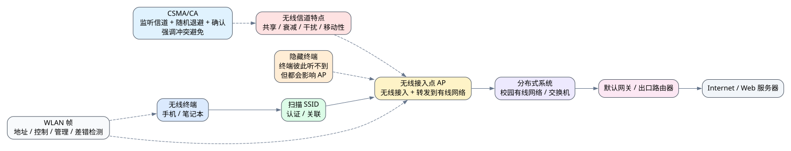

# 第八章 WLAN

## 8.1 本章导入

前面学习局域网时，主要讨论了以太网和交换机转发等内容。这些内容大多基于有线网络环境：设备通过网线接入交换机，链路相对稳定，信号干扰较少，冲突检测和帧转发机制也比较清晰。

WLAN 是 Wireless Local Area Network，即无线局域网。它最常见的形式就是 Wi-Fi。学生在宿舍、教室、图书馆或实验室中使用手机、笔记本连接校园 Wi-Fi，本质上就是通过 WLAN 接入网络。

WLAN 要解决的核心问题是：

> 如何让无线终端通过共享无线信道接入局域网，并进一步访问 Internet。

与有线以太网相比，WLAN 不是简单地“把网线去掉”。无线信道具有衰减、干扰、共享、移动性和隐藏终端等问题，因此 WLAN 在体系结构、帧格式和多路访问机制上都有特殊设计。

---

## 8.2 WLAN 的基本体系结构

WLAN 通常由无线终端、无线接入点和分布式系统组成。

| 组成部分 | 作用 |
|---|---|
| 无线终端 | 使用无线网卡接入网络的设备，如手机、笔记本、平板 |
| 无线接入点 | 也称 AP，负责连接无线终端和有线网络 |
| 分布式系统 | 连接多个 AP 的网络系统，通常接入校园网、企业网或运营商网络 |

可以简单理解为：

> 无线终端通过 AP 接入局域网，AP 再把数据转发到更大的网络中。

例如，在校园 Wi-Fi 场景中，学生手机不是直接连接整个 Internet，而是先连接附近的 AP。AP 再通过校园有线网络、交换机、路由器和出口设备把数据送往外部网络。

---

## 8.3 无线接入点 AP 的作用

无线接入点是 WLAN 中非常关键的设备。它既要和无线终端通信，又要连接后方的有线网络。

AP 的主要作用包括：

- 提供无线信号覆盖
- 允许无线终端接入
- 转发无线终端与有线网络之间的数据
- 管理无线终端的关联和认证
- 协调无线信道访问

很多同学会把 AP、路由器和无线终端混在一起。严格来说，AP 主要负责无线接入；路由器主要负责不同网络之间的转发；无线终端则是使用 WLAN 的设备。家用无线路由器通常把 AP、交换机和路由功能集成在同一台设备中，所以容易造成概念混淆。

在校园网中，AP 通常只是无线接入设备，真正的路由、认证、出口管理可能由校园网中的其他设备完成。

---

## 8.4 无线终端的角色

无线终端是接入 WLAN 的用户设备，例如手机、笔记本电脑、平板或物联网设备。

无线终端接入 WLAN 时，通常需要完成扫描、选择网络、认证、关联和获取网络配置等过程。连接成功后，终端可以通过 AP 与局域网或 Internet 通信。

以手机连接校园 Wi-Fi 为例，手机首先扫描周围可用的无线网络，选择目标 SSID 后与 AP 建立关联。如果网络需要认证，用户还需要输入密码或通过校园网认证页面完成登录。随后设备可能通过 DHCP 获取 IP 地址、默认网关和 DNS 服务器等配置，最后才能正常访问网页或应用服务。

因此，无线终端并不是简单“连上信号”就完成全部网络过程。真正访问网络还需要 WLAN 接入、链路层通信、网络层配置和应用层协议共同配合。

---

## 8.5 WLAN 与有线以太网的区别

WLAN 和有线以太网都属于局域网技术，但它们面对的传输环境不同。

有线以太网通常通过双绞线和交换机连接，链路相对稳定，设备之间的物理连接明确。WLAN 则使用无线信道，多个终端共享同一空间中的无线介质，信号容易受到距离、障碍物、同频干扰和设备移动的影响。

二者的区别可以概括如下：

| 对比项 | 有线以太网 | WLAN |
|---|---|---|
| 传输介质 | 双绞线、光纤等有线介质 | 无线信道 |
| 接入方式 | 插入网线连接交换机 | 通过无线信号连接 AP |
| 稳定性 | 通常较稳定 | 容易受距离、遮挡、干扰影响 |
| 移动性 | 较弱 | 较强 |
| 共享问题 | 现代交换式以太网冲突较少 | 多个终端共享无线信道 |
| 介质访问 | 有线环境较容易控制 | 无线冲突检测困难 |

所以，WLAN 不能简单理解成“没有网线的以太网”。无线环境本身带来了新的链路层问题。

---

## 8.6 无线链路层帧格式

WLAN 中的数据传输也以帧为基本单位。无线链路层帧不仅要承载数据，还需要携带地址、控制和管理信息，以适应无线接入、移动性和 AP 转发等需求。

无线链路层帧通常涉及以下信息：

| 信息类型 | 作用 |
|---|---|
| 地址信息 | 标识发送方、接收方、AP 或分布式系统相关地址 |
| 控制信息 | 表示帧类型、传输控制和状态信息 |
| 管理信息 | 支持接入、认证、关联、漫游等过程 |
| 差错检测信息 | 判断帧在传输过程中是否出错 |

有线以太网帧主要围绕源 MAC 地址、目的 MAC 地址和数据承载展开，而 WLAN 帧需要适应更复杂的无线接入场景。例如，一个无线终端发送数据给外部网络时，帧中可能既要体现无线终端信息，又要体现 AP 的转发角色。

因此，WLAN 帧格式比普通以太网帧更复杂，并不是简单复制以太网帧。

---

## 8.7 无线信道的特点

WLAN 使用无线信道进行通信，而无线信道具有明显的不稳定性和共享性。

主要特点包括：

| 特点 | 说明 |
|---|---|
| 共享性 | 多个无线终端可能使用同一信道 |
| 衰减 | 信号会随距离增加而减弱 |
| 干扰 | 其他无线设备、障碍物和同频网络会影响通信 |
| 移动性 | 终端位置变化会导致信号质量变化 |
| 隐藏终端问题 | 两个终端彼此听不到，但都能影响同一个 AP |

其中，隐藏终端问题是 WLAN 中非常经典的问题。

例如，终端 A 和终端 B 距离较远，彼此收不到对方信号，但它们都能和同一个 AP 通信。如果 A 和 B 同时向 AP 发送数据，AP 处就可能发生冲突。由于 A 和 B 互相“听不见”，它们难以及时判断对方正在发送。

这说明无线网络中的冲突问题比有线网络更复杂。

---

## 8.8 WLAN 中的多路访问问题

在 WLAN 中，多个无线终端共享同一无线信道。如果多个终端同时发送数据，就可能造成信号冲突。链路层需要设计多路访问机制，协调这些终端对无线信道的使用。

有线以太网中曾经使用 CSMA/CD，即载波监听多路访问/冲突检测。它的思想是发送前监听信道，发送时如果检测到冲突就停止发送。

但是在 WLAN 中，冲突检测非常困难。原因包括：

- 无线终端发送信号时，很难同时准确接收其他终端信号。
- 发送端检测不到接收端附近是否发生冲突。
- 隐藏终端问题会导致发送端误以为信道空闲。
- 无线信号衰减和干扰会让信道状态判断不稳定。

因此，WLAN 更强调冲突避免，而不是冲突检测。典型思想是 CSMA/CA，即载波监听多路访问/冲突避免。

可以简单理解为：

> 有线网络更容易“边说边听有没有撞车”，无线网络更倾向于“说之前尽量避免撞车”。

---

## 8.9 CSMA/CA 的基本思想

CSMA/CA 的目标是尽量减少无线终端同时发送造成的冲突。

其基本思想可以概括为：

1. 终端发送前先监听信道。
2. 如果信道空闲，不一定立刻发送，而是等待一定时间。
3. 多个终端通过随机退避机制错开发送时机。
4. 接收方收到数据后返回确认。
5. 如果发送方没有收到确认，可能认为发生冲突或丢失，再尝试重传。

随机退避机制非常重要。因为多个终端可能同时发现信道空闲，如果它们都立刻发送，就容易发生冲突。随机等待可以降低同时发送的概率。

确认机制也很重要。由于无线环境下发送方难以直接检测冲突，所以通常通过是否收到接收方确认来判断数据是否成功传输。

---

## 8.10 示例：手机连接校园 Wi-Fi

假设学生的手机连接校园 Wi-Fi 并访问外部网站。这个过程可以从 WLAN 角度理解。

首先，手机作为无线终端扫描周围可用的无线网络，找到校园 Wi-Fi 的 SSID。用户选择该网络后，手机与附近 AP 建立连接，并可能完成认证和关联。

接着，手机通过 AP 接入校园网络。AP 负责在无线终端和校园有线网络之间转发数据。手机访问网站时，数据先通过无线链路发送到 AP，再经过校园网络、网关和外部 Internet 到达目标服务器。

在无线链路上传输时，手机和 AP 使用 WLAN 帧进行通信。由于无线信道是共享的，如果周围有很多终端同时连接同一个 AP，就需要多路访问机制协调信道使用，减少冲突和重传。

如果手机距离 AP 较远，或者周围存在强干扰，可能会出现延迟升高、速率下降、丢包增加等现象。这些问题并不一定是外部 Internet 慢，也可能是 WLAN 无线链路质量较差。

---

## 8.11 常见误区

### 误区一：把 WLAN 简单理解成“没有网线的以太网”

WLAN 和以太网都属于局域网技术，但无线信道具有衰减、干扰、共享和隐藏终端等问题，因此 WLAN 的帧格式和介质访问机制都有特殊设计。

### 误区二：忽略无线信号干扰和移动性

无线网络性能不只取决于带宽，还受到距离、墙体遮挡、同频干扰、终端数量和移动状态影响。离 AP 更近通常信号更好，但也不代表一定不会拥塞。

### 误区三：混淆 AP、路由器和无线终端

AP 负责无线接入，无线终端是接入 WLAN 的设备，路由器负责不同网络之间的转发。家用无线路由器集成了多种功能，但概念上不能完全等同。

### 误区四：认为无线网络也可以像有线网络一样方便地检测冲突

无线环境中冲突检测困难，所以 WLAN 更强调冲突避免。CSMA/CA 的设计动机正是为了适应无线信道特点。

---

## 8.12 实操任务

### 任务一：绘制校园 Wi-Fi 体系结构图

画出手机或笔记本连接校园 Wi-Fi 并访问 Internet 的结构图，至少包含：

- 无线终端
- 无线接入点 AP
- 校园有线网络
- 默认网关或出口路由器
- 外部 Internet
- Web 服务器

重点说明无线终端和 AP 之间属于无线链路，AP 后方通常连接有线分布式系统。

### 任务二：说明 AP 的作用

结合校园 Wi-Fi 或宿舍 Wi-Fi，说明 AP 在无线接入中的作用。

建议从以下角度分析：

- 终端如何接入 AP
- AP 如何连接后方网络
- AP 为什么不是简单的“信号发射器”
- 家用无线路由器为什么容易让人混淆 AP 和路由器

### 任务三：对比有线以太网和 WLAN 的介质访问

完成下表：

| 对比项 | 有线以太网 | WLAN |
|---|---|---|
| 介质 | 网线或光纤 | 无线信道 |
| 冲突检测 | 有线环境较容易检测 | 无线环境较困难 |
| 主要问题 | 共享链路冲突、交换转发 | 干扰、衰减、隐藏终端 |
| 典型思想 | CSMA/CD 或交换式转发 | CSMA/CA |
| 移动性 | 较弱 | 较强 |

---

## 8.13 本章小结

WLAN 是无线局域网技术，常用于校园、家庭和公共场所的网络接入。它通过无线链路连接终端和接入点，再由接入点接入后方网络。

本章重点掌握三条主线。第一，WLAN 的体系结构，包括无线终端、接入点和分布式系统。第二，无线链路层帧格式的作用，它需要承载地址、控制和管理信息，以适应无线接入和移动性。第三，无线多路访问机制的设计动机，特别是无线信道共享、干扰、衰减和隐藏终端带来的冲突避免需求。

学习 WLAN 时，关键不是把它看成“无线版以太网”，而是要理解无线环境本身带来的特殊问题。只有理解这些问题，才能解释为什么 Wi-Fi 会受距离、墙体、人数、干扰和 AP 部署影响，也能更准确地区分无线终端、接入点和路由器的角色。
